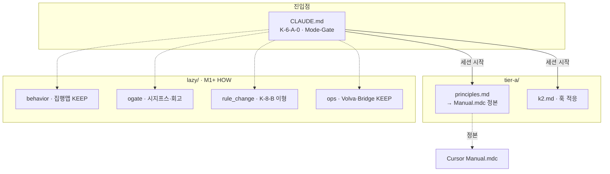

# CC 룰트리 (Claude Code Rule Tree) · `0_Config/cc_rules/`

> **CC 룰트리** = Claude Code 하네스 규칙 계층 매핑. Cursor `.mdc` 룰트리와 구별.  
> **정본 출처**: `CLAUDE.md §K-6-A-0` · `.cursor/rules/RULE_TREE.md` · `0_Config/RULE_TREE_COMBINED.md`  
> **신규·수정 MUST** → 이 파일 + `RULE_TREE_COMBINED.md` 동시 갱신.  
> **Write checklist**: 갱신 후 `0_Config/RULE_TREE_COMBINED.md` §갱신 체크리스트 대조 · 선택 `python automation/harness_sync.py verify` (`rule_paths` delta).

---

## 디렉터리 구조 (물리 배치 — Cursor `tier-a/canon-lazy/reference-lazy` 워크트리 패턴과 동형)

```
0_Config/cc_rules/
├── tier-a/                — 세션 시작 항시 로드 · 위반 즉시 FAIL
│   ├── principles.md      — M→Manual 포인터 · K-0-* · Soul · Mode-Gate
│   └── k2.md              — K-2 훅 적응표 (정의 정본=Core §K-2)
├── lazy/                  — 트리거 발생 시 로드 · **M1+ Judge HOW**
│   ├── behavior.md        — 집행 현황 맵 · PR1·B/RC·ARP·D-24·D-25
│   ├── ogate.md           — O0~O4 적응 · 시지프스 · 회고 · 깃일임
│   ├── rule_change.md     — K-8-B CC이형 · D-10 · N1~N5
│   └── ops.md             — Volva·블랙페이퍼·cc_bridge·루프·PU · **KEEP**
├── specialty-lazy/        — 도메인 특화
│   ├── or_slack_layer.md
│   └── unity_workflow.md
├── _audit/                — F1~F4 감사 리포트 (규범 아님)
└── RULE_TREE.md           ← 이 파일
```

> **원게이트 (2026-07-15)**: 일상 M0 Solo 정본 = Cursor `.mdc` · 본 CC 트리는 **M1+ Judge/Relay/Volva/cc_bridge** 및 훅 HOW. `ntd-114` 포인터화 **완료**. 구 NTD=`dead` → LT=`cc_volva.json`.

---

## 계층 연결 다이어그램



---

## 로드 트리거 표

| 트리거 상황 | 로드 파일 |
|------------|---------|
| 세션 시작 (항시 MUST) | `tier-a/principles.md` · `tier-a/k2.md` (+ Cursor Manual 정본 인지) |
| PR1·B·RC·ARP·D-24·D-25 · **집행맵** | `lazy/behavior.md` |
| Write/Shell/MCP/git 후 출력 · 시지프스·회고 | `lazy/ogate.md` |
| `.mdc`·CLAUDE 수정 / D-10 / N1~N5 | `lazy/rule_change.md` |
| Volva·오류·cc_bridge·루프·PU | `lazy/ops.md` (**M1+ KEEP**) |
| 슬랙 OR / Unity | `specialty-lazy/*` |

---

## Hook 집행 현황 (자기집행 vs Hook — **정본**: `behavior.md §집행 현황 맵`)

> 상세 훅 표·커버 규칙·집행 등급은 `behavior.md §집행 현황 맵` 참조. 본 절 Hook 표는 포인터-only — N3 중복 방지.
