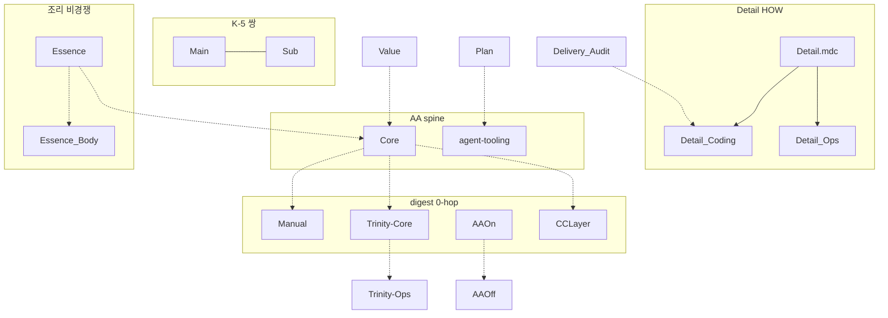

<!-- MIRROR-GENERATED -->
> [!warning] 생성 파일 — 여기서 편집하지 마세요
> 이 문서는 `.cursor/rules/RULE_TREE.md` 에서 자동 생성된 **사본**입니다.
> 여기 가한 수정은 다음 동기화(`obsidian_archive.regenerate_rules_mirror`)에
> 정본 내용으로 **덮어써져 사라집니다**. 고칠 곳은 위 정본 경로입니다.

# 룰트리 (Rule Tree) · `.cursor/rules/`

> **룰트리** = **18** `.mdc` **헌법 계층**(3-a 우선순위 + 로드축). **≠** git worktree · **≠** `.cursor/skills/` 스킬트리.  
> **원게이트 (Mode-Gate)**: `is_trinity_relay_active` false=**M0 Solo**(본 트리만·§T-4a·Judge OFF) / true=**M1+**(COMBINED 교차·CG/Grok Judge+Cursor Mutation·T-V ON). Claude/Codex는 보조.  
> **D-ID · §절 = 토픽 식별자** — 번호·파일 나열 순서 **≠** 로드·적용 순서.  
> **신규·교체·이동 MUST** → Core **K-0-C-A** · Detail **D-7-B** · PV **`ruleTree`**  
> **CC 교차** → `0_Config/RULE_TREE_COMBINED.md` · CC 트리 → `0_Config/cc_rules/RULE_TREE.md`
> **등록 도메인 정본**: `projects/gitter/CANON.md` 같은 등록 정본은 18 `.mdc` 전역 트리
> 밖에서 자기 도메인만 소유하고, 하나의 `.mdc` 진입 포인터가 가진 기존 순위를
> 상속한다. 두 번째 전역 룰트리가 아니며 본 트리의 개수·3-a를 바꾸지 않는다.

## 직교 축 (혼동 금지)

물리 폴더 · alwaysApply · 3-a 충돌순위 · 층접두어 · 로드 트리거는 **같은 화살표가 아니다.** 한 mermaid에 섞으면 3-a가 로드 순서로 오독된다.

| 축 | 정본 | 하는 일 | 하지 않는 일 |
|----|------|---------|--------------|
| **물리** | `rule_paths.WORKTREE_BY_FILENAME` · 아래 디렉터리 트리 | 파일 위치 · orphan 금지 | 적용 순위 |
| **로드** | `ALWAYS_APPLY_NAMES` · `mdc_digest` · 토픽 트리거 | 언제 본문을 읽나 | 충돌 시 누가 이기나 |
| **3-a** | Core K-0 L47 · `dashboard_sync.statuteChain` | **② 성문끼리** 충돌 시 위가 이김 | Essence/Value/Plan/① 1.5 · 파일 읽기 순서 |
| **층** | Core 상단 E/C/D/M/B · `LAYER_STACK` | 코드 접두어(K·D·M·A·B) 소속 | 폴더명 |
| **교차우선** | Core K-0 `1-1 → ② → 1 → 1.5 → 1-2` | 유저 지시·성문·Behavior·Technique | 3-a 내부 순위(그건 ② 안) |

**3-a (성문 ②만)**: `Core > Manual > Trinity-Core > agent-tooling > Main > Sub > Detail*` — Essence·Value·Plan·Delivery_Audit·① 1.5(AAOn/AAOff)·CCLayer는 3-a **미포함**.  
**런타임 상위(파일 밖)**: Rule 1(이번 턴 지시) > IDE User rules(비헌법) > ② 성문 · 관습=`Realm.md` `CUSTOMARY_REGISTRY` 등재분만(K-0-D). 표 복제 금지 — `CONSTITUTION_LAYERS`.

## 디렉터리 트리 (물리 배치)

```
.cursor/rules/
├── tier-a/              ← Coding Harness (물리) · AA spine=Core+agent-tooling · Manual/Trinity lazy+digest (P1-D2)
│   ├── cursorrules_Core.mdc             ← alwaysApply spine · 3-a #1 · 층 C (+§M 이관분)
│   ├── cursorrules_Manual.mdc           ← alwaysApply:false · 3-a #2 · 층 M · digest 0-hop
│   ├── cursorrules_Trinity-Core.mdc     ← alwaysApply:false · 3-a #3 · §T-Mode · digest 0-hop
│   ├── agent-tooling.mdc                ← alwaysApply spine · 3-a #4 · K-7
│   ├── cursorrules_Technique_AAOn.mdc   ← alwaysApply:false · ① 1.5 · O 0-hop via mdc_digest
│   └── cursorrules_CCLayer.mdc          ← alwaysApply:false · K-8 0-hop via mdc_digest · 3-a 밖
├── technique-lazy/      ← ① 1.5 HOW 지연 (Gitter 포인터/deploy/MCP/n8n)
│   └── cursorrules_Technique_AAOff.mdc
├── canon-lazy/          ← ② Main/Sub + Detail* + Essence* (K-5·조리)
│   ├── cursorrules_Main.mdc
│   ├── cursorrules_Sub.mdc
│   ├── cursorrules_Detail.mdc          ← 토픽 라우터 (목차) · 3-a Detail*
│   ├── cursorrules_Detail_Coding.mdc   ← Tier A HOW
│   ├── cursorrules_Detail_Ops.mdc      ← Tier B HOW
│   ├── cursorrules_Essence.mdc         ← 조리 핵심 (D-10·§6) · 비경쟁
│   ├── cursorrules_Essence_Body.mdc    ← 조리 확장 (B·PR·O·§4~§5) · 비경쟁
│   └── cursorrules_Trinity-Ops.mdc    ← T-Violation · §T-4/T-4a
└── reference-lazy/      ← 명명·Config·Day1 (조리·경쟁 없음)
    ├── cursorrules_Value.mdc
    ├── cursorrules_Plan.mdc
    └── cursorrules_Delivery_Audit.mdc  ← Delivery intent audit (Q축)
```

## 18파일 신분 (물리 × 로드 × 3-a × 층)

> 성격 라벨(Apocrypha/Blueprint) 정본 = `RULE_CHARACTER_ROWS`. 본 표는 **축 교차만**.

| 파일 | 물리 | 로드 | 3-a | 층 |
|------|------|------|-----|----|
| Core | tier-a | AA | 1 | C · §M 이관=M |
| Manual | tier-a | digest | 2 | M |
| Trinity-Core | tier-a | digest | 3 | Mode-Gate (E/C/D/M/B 밖) |
| agent-tooling | tier-a | AA | 4 | C (K-7) |
| AAOn | tier-a | digest | 밖 | ① 1.5 |
| CCLayer | tier-a | digest | 밖 | C (K-8) |
| AAOff | technique-lazy | 트리거 | 밖 | ① 1.5 |
| Main | canon-lazy | K-5 쌍 | 5 | C (무엇·누가) |
| Sub | canon-lazy | K-5 쌍 | 6 | Blueprint (어떻게) |
| Detail.mdc | canon-lazy | 목차 | 7* | D 라우터 |
| Detail_Coding | canon-lazy | 코딩 트리거 | 7* | D Tier A |
| Detail_Ops | canon-lazy | 운영 트리거 | 7* | D Tier B |
| Essence | canon-lazy | 채점·§6 | 밖 | E (비경쟁) |
| Essence_Body | canon-lazy | 해석·세션 | 밖 | B (비경쟁) |
| Trinity-Ops | canon-lazy | T-V / §T-4a | 밖 | Trinity HOW |
| Value | reference-lazy | 참조 | 밖 | 부록 §0·Schema |
| Plan | reference-lazy | Day 1 | 밖 | 부록 P-1 |
| Delivery_Audit | reference-lazy | 구현·품질 | 밖 | Q축 |

`7*` = Detail 가족. 라우터와 자식은 우열이 아니라 **포함**. 충돌 시 3-a는 Detail 가족 전체가 Core~Sub 아래.

## 연결 종류

| 종류 | 의미 |
|------|------|
| **정본** | MUST 문장 위치 |
| **HOW** | 절차·예외. 정본을 이기지 않음 (K vs D) |
| **포인터** | CC 적응. Cursor=정의 · CC=훅/판정 HOW (`ntd-114`) |
| **쌍** | 같이 로드. 우열 아님 (K-5 Main+Sub) |
| **이관** | 조항 번호 유지, 파일만 이동 (Core §M ← Manual) |
| **발번 이원** | D-ID는 Detail 라우터, 본문은 CC `behavior.md` |
| **조리** | 해석만. 승패·override 없음 |

## 연결 (파일 간)

| from | to | 종류 | 비고 |
|------|----|------|------|
| Core §M | Manual | 이관 | M-0-F·M-0-C·M-0-H·M-1·M-2 정본=Core. 나머지 M=Manual |
| Trinity-Core | Trinity-Ops | HOW | §T-0·§T-1 정본=Core파일. §T-2~T-V·§T-4a=Ops |
| AAOn | AAOff | HOW | Gitter ingress·1.5-2~3(+FACE) vs 1.5-4~9·LG·MCP·Tier B |
| Essence | Essence_Body | 조리 | 핵심 vs B·PR·O·RC 확장 |
| Essence | Core | 조리 | 충돌 해석. 성문 무효화 금지 |
| Value §0 | Core 패널 | 부록 | CONFIG/VAL. 성문 아님 |
| Plan P-1 | agent-tooling | 부록 | Degraded 행렬. Tier B≠필수 |
| Detail.mdc | Coding / Ops | HOW | D-ID 목차. 전문 복제 금지 |
| Main | Sub | 쌍 | K-5면 **동시**. 우열 아님 |
| Core | CCLayer | 정본→레이어 | K-8 Judge. 3-a 밖 |
| CCLayer | COMBINED · cc_bridge | 포인터 | **M1+만**. M0에서 T-V 강제 금지 |
| Delivery_Audit | 구현 턴 | Q축 | 3-a 밖. literal checklist ≠ done |
| Detail.mdc D-14-G·D-24·D-25·D-26·D-28 | CC `lazy/behavior.md` | 발번 이원 | 라우터 행 유지. Cursor Detail_* 에 본문 없음 |
| Core §K-2 | CC `k2.md` | 포인터 | 정의 vs 훅 적응 |
| Essence_Body §0-A-O · AAOn | CC `ogate.md` | 포인터 | 정의·집행 vs 판정 HOW |
| Manual M-* | CC `principles.md` | 포인터 | Cursor=정본 |

D-ID 전체 표는 `cursorrules_Detail.mdc` 정본 — 여기 복제 금지.

## 3-a 충돌 (로드 아님)


## 로드·의존 (3-a 화살표 아님)



## 로드 트리거 (토픽 — **순서 아님**)

| 트리거 | 파일 |
|--------|------|
| 항시 커널 K-0~K-6 · K-6-A-0 · §M 이관분 | `cursorrules_Core.mdc` (AA) |
| K-7 도구·skill·command 라우팅 | `agent-tooling.mdc` (AA) |
| M-0-G·M-0~M-0-E·M-3~M-6 자기집행 (M-0-F·M-0-C·M-0-H·M-1·M-2=Core §M.) · Mode-Gate · **M-0-G** attempt원자성 · **M-0-E** 세션면 · **M-6** 모델 표면 | `cursorrules_Manual.mdc` |
| §T-0·§T-1 · Mode-Gate 판정 | `cursorrules_Trinity-Core.mdc` |
| O-gate · Gitter 진입 포인터 · verify · ARP HOW · **1.5-2-FACE** (또는 digest 0-hop) | `cursorrules_Technique_AAOn.mdc` |
| 세션면 ★S · UF/IN · **SF-T0/SF-T1/SF-T2** · Face×Mode · Soft≠Hard | `Detail_Coding.mdc` **D-27** · `automation/session_face.py` · Core K-6-A-0 · Manual **M-0-E** · AAOn **1.5-2-FACE** |
| K-8 Judge · C1/C2+ debate · artifact registry | `cursorrules_CCLayer.mdc` |
| Gitter 포인터/deploy/MCP/n8n · LG-T1~3 | `cursorrules_Technique_AAOff.mdc` |
| 세션 초기화 · 방화벽·연옥 · Judge · 기획 · 종료·이관 | `cursorrules_Main.mdc` **+** `cursorrules_Sub.mdc` (K-5 쌍) |
| D-10·§6·A 격자 | `cursorrules_Essence.mdc` |
| B·PR·O·RC·§4~§5 해석 | `cursorrules_Essence_Body.mdc` |
| ARP·F-gate·D-10·B·충돌·출력 | `cursorrules_Detail_Coding.mdc` |
| Relay·배포·Bitu·규칙개정·갱신 | `cursorrules_Detail_Ops.mdc` |
| D-ID 위치만 확인 | `cursorrules_Detail.mdc` (라우터) |
| Config Panel·Active Schema·§4-B | `cursorrules_Value.mdc` |
| Day 1 · P-1 Degraded | `cursorrules_Plan.mdc` |
| 구현 완료 delivery intent 확인 | `cursorrules_Delivery_Audit.mdc` |
| cc_bridge·delegation·Judge 경유 턴 T-Violation 판정 | `cursorrules_Trinity-Ops.mdc` (**M1+**) · M0는 §T-4a만 |

## 대시보드 · AA spine 집행 (포인터)

| 경로 | 역할 |
|------|------|
| `automation/dashboard_sync.py` | `CONSTITUTION_LAYERS` · `LAYER_STACK` · `check_aa_spine_constitution` · `enforcementArena` — 계층 지도·디스크 alwaysApply drift·집행 패널 (전문 목록은 코드 정본) |
| `EXE/sync_dashboard.sh` | 스냅샷 → 로컬/Cloud Run 대시보드 |
| `EXE/deploy_dashboard.sh` | BUILD_ID bump 후 라이브 배포 |

## 코드 앵커

| 모듈 | 역할 |
|------|------|
| `automation/rule_paths.py` | `WORKTREE_BY_FILENAME` · `find_rule()` · `audit_worktree_layout()` |
| `automation/split_canon_essence_detail.py` | Essence/Detail 토픽 분할 재생성 (D-7-B와 별도) |
| `automation/rule_reloc.py` | D-7-B ledger · `git mv` · **finalize** |
| `automation/harness_reference_tables.py` | `RULE_CHARACTER_ROWS` · `RULE_INDEX_ROWS` |
| `0_Config/rule_deletion_guard_baseline.json` | LG-T2 앵커 (tier-a) |
| `0_Config/RULE_TREE_COMBINED.md` | CC↔Cursor 교차 · Mode-Gate |

## 금지

- `.cursor/rules/*.mdc` **루트 flat** 배치 (orphan)
- **D 번호 순**으로 파일을 읽거나 로드한다고 가정
- **3-a 화살표 = 로드 순서**로 읽기 (직교 축 붕괴)
- 룰트리 **밖**에 신규·교체 `.mdc` 두기
- 이동을 **포인터-only**로 대체 (실제 `git mv` 필수 — D-7-B)
- 표를 User rules·skill에 복제 (K-0-C)
- M0 Solo에서 T-V·Judge Oath를 **강제** (Mode-Gate 위반)
- 발번 이원 D-ID를 Cursor Detail_* 에 본문 복제 (N3)
