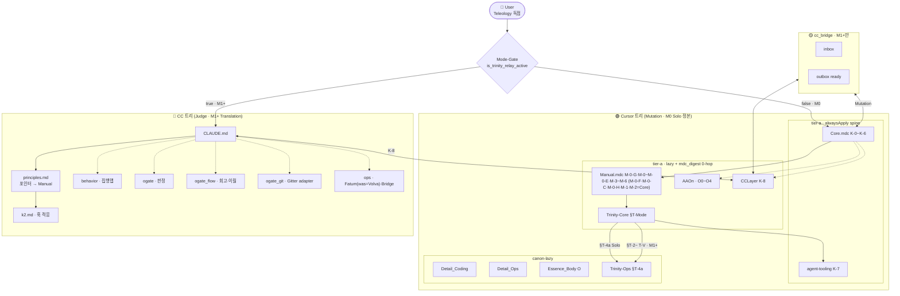

<!-- MIRROR-GENERATED -->
> [!warning] 생성 파일 — 여기서 편집하지 마세요
> 이 문서는 `0_Config/RULE_TREE_COMBINED.md` 에서 자동 생성된 **사본**입니다.
> 여기 가한 수정은 다음 동기화(`obsidian_archive.regenerate_rules_mirror`)에
> 정본 내용으로 **덮어써져 사라집니다**. 고칠 곳은 위 정본 경로입니다.

# 통합 룰트리 (Combined Rule Tree)

> **CC 트리** + **Cursor 트리** 연결 지도.  
> CC 개별 트리: `0_Config/cc_rules/RULE_TREE.md`  
> Cursor 개별 트리: `.cursor/rules/RULE_TREE.md`  
> **연결 게이트**: `cursorrules_CCLayer.mdc` (K-8) · `cc_bridge/` 파일 브릿지  
> **원게이트 (Mode-Gate)**: `harness_sync.is_trinity_relay_active`  
> — **false = M0 Solo**: Cursor RULE_TREE만 · §T-4a · Judge/Relay/T-V OFF  
> — **true = M1+**: 본 COMBINED 교차 · CG/Grok Judge + Cursor Mutation · T-V ON · Claude/Codex 보조  
> **TEMP DUP purge**: `ntd-114` **completed 2026-07-15** — M/A/B/D-10 포인터화 · CC=M1+ HOW KEEP  
> **NTD→Fatum**: `cc_ntd.json`=`dead` · 장기 LT=`cc_volva.json` (path KEEP · was=Volva · ≠ session orchestrator)

---

## 두 트리의 역할 분리

| 축 | 트리 | 주체 | 집행 방식 | Mode-Gate |
|----|------|------|----------|-----------|
| **Mutation** (일상 코딩) | Cursor 트리 | Cursor 세션 | `.mdc` alwaysApply spine · lazy peers | **M0 Solo 정본** |
| **Auxiliary** (분석·검토·명시 위임) | CC 트리 | Claude Code | Hook + 자기집행 | **보조 경로만** |
| **Teleology** (목적·우선순위) | 없음 | 유저 (외부) | 직접 발화·승인 | 항상 |

> Trinity 불변식 정본 → `cursorrules_Trinity-Core.mdc §T-0` · Mode-Gate → §T-Mode  
> Cursor 물리 18 `.mdc` · AA diet(`ntd-110`): **alwaysApply spine=Core·agent-tooling** · Manual·Trinity-Core=`alwaysApply:false`+`mdc_digest` (3-a 우선순위 ≠ AA) · AAOn/CCLayer=lazy+digest  
> **3-a 전문**: Core K-0만 · 본 파일=연결 지도 · 대시보드 `constitution.aaSpine`/`statuteChain` 포인터 (`dashboard_sync.py`)

---

## 통합 계층 다이어그램

---

## Cursor 측 생략 복원 (연결 — 3-a 아님)

COMBINED mermaid는 Mode-Gate 분기만 그린다. Cursor 18파일 엣지 정본 = `.cursor/rules/RULE_TREE.md` §연결. 여기서 빠지면 끊긴 줄로 오독되는 것만 복원.

| Cursor | 연결 | 비고 |
|--------|------|------|
| Main + Sub | K-5 **쌍** 동시 로드 | 우열 아님. mermaid 생략 금지 대상 |
| Detail.mdc → Coding / Ops | HOW 자식 | 3-a Detail* 가족 |
| Essence → Essence_Body | 조리 확장 | 비경쟁 |
| AAOn → AAOff | ① 1.5 HOW | 3-a 밖 |
| Delivery_Audit | Q축 · 구현 턴 | 3-a 밖 · 고아 금지 |
| D-14-G · D-24 · D-25 · D-26 · D-28 | CC `lazy/behavior.md` | 발번 이원. Cursor Detail_* 본문 없음 |

---

## 교차 참조 (CC ↔ Cursor) — 원게이트 정렬 후

| CC 규칙 | Cursor 대응 | 연결 · 비고 |
|---------|-----------|---------|
| `principles.md` M-* | **`cursorrules_Manual.mdc`** (+`Core.mdc §M.*`=M-0-F·M-0-C·M-0-H·M-1·M-2 이관분) | Cursor=정본 · CC=포인터 (`ntd-114` done) |
| `k2.md` | `Core.mdc §K-2` | Cursor=정의 · CC=훅 적응표 |
| `behavior.md` ARP/B/A | Detail_Coding · Essence* | CC=집행맵 KEEP |
| `ogate.md` | Essence_Body §0-A-O · AAOn | Cursor=정의·집행 · CC=O-gate **판정** HOW |
| `ogate_flow.md` | AAOn 1.5-2 · Essence_Body §0-A-O | CC=회고·O1-운영·세션 이월 (CLAUDE.md lazy) |
| `ogate_git.md` | `projects/gitter/CANON.md` | Gitter thin adapter · Git HOW/완료 정본은 Gitter (정의 복제 금지) |
| `rule_change` D-10/D-10-S | **Detail_Coding §D-10** | Cursor=정본 · CC=포인터 (`ntd-114` done) |
| `rule_change` K-8-B | CCLayer · Detail_Ops D-7 | CC=Judge 실행이형 KEEP (C0 Silent금지) |
| `ops.md` Fatum(was=Volva)·Bridge | Detail_Ops D-18·D-21 | CC=실행 · Cursor=정의 · **NTD archive≠Fatum** |
| CLAUDE.md K-6-A-0 | Core §K-6-A-0 | CC=발췌 · Cursor=전문 |
| `trinity_work_manual` | Trinity-Core/Ops | **M1+ KEEP** |
| `mdc_digest.md` | AAOn · CCLayer 0-hop | `ntd-110` demoted peers |
| (★S) 세션면 UF/IN · SF-T* | Core K-6-A-0 · Manual **M-0-E** · Detail **D-27** · AAOn **1.5-2-FACE** | `session_face.py` · Face⊥Mode-Gate · ≠ O-gate 턴 T* |

---

## 갱신 체크리스트

- [x] `.cursor/rules/RULE_TREE.md` §직교 축 · §연결 — 물리/로드/3-a/층 분리 · 발번 이원
- [x] 해당 개별 트리 (`cc_rules/RULE_TREE.md` · `.cursor/rules/RULE_TREE.md`) — 물리 18 `.mdc` · Mode-Gate·Volva 정렬
- [x] 이 파일 — Mode-Gate · 교차 참조 · spine vs digest 다이어그램
- [x] `automation/rule_paths.py` `WORKTREE_BY_FILENAME` — audit `ok` / 18 files
- [x] `automation/harness_reference_tables.py` `RULE_CHARACTER_ROWS` · `RULE_INDEX_ROWS` (Mode-Gate·Volva·digest)
- [x] TEMP DUP purge · NTD→Volva 사망선고 반영 (`cc_ntd.json` dead · `cc_volva.json`)
